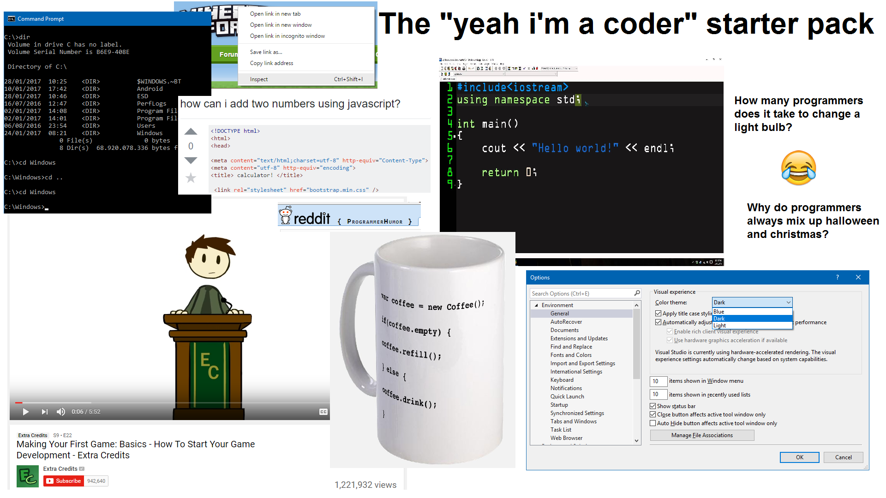

<div class="content">

Once upon a time I tried creating a blog before entering the programming industry. I used Jekyll and wrote some random posts about what I learned.

This time around I decided to take the path of least resistance.

I did not have strict requirements other than it being as easy as it gets.

Search Terms to google
```
Static Site Generator 2019
CSS framework 2019
```

And the links that got me up to speed
```
https://www.gatsbyjs.org/docs/
https://www.gatsbyjs.org/docs/bulma/
```

Not too bad, then take the blog starter template and revamp it to look like a boring webpage.



</div>
